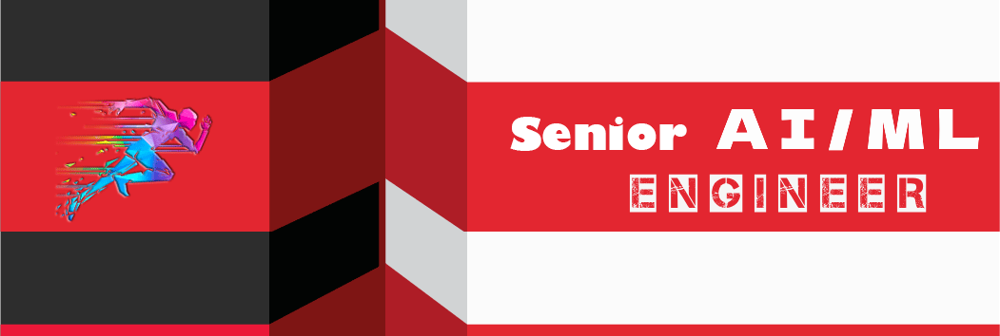

### 🌐 [View my full portfolio site →](https://brisok11.github.io/brisok11/)

I’m a **Senior AI Engineer** and **Model Evaluation Specialist** with 8+ years of experience building backend systems, APIs, automation workflows, and **AI-powered solutions**.

I’d love to explore ways we can work together. And if AI is **NEW** to you, no worries — I can explain **everything** clearly and guide you through the process.

- 👯 I’m looking to collaborate with you.

##  My Recent Projects 
#### 1. [Kubetorch](https://github.com/brisok11/kubetorch)(Python, Kubernetes) — Serverless ML workloads & distributed training on K8s
#### 2. [Harness](https://github.com/brisok11/harness)(PyTorch, RL) — RL search agent with stateful retrieval & model evaluation
#### 3. Model Evaluation Pipelines(Python, LLM APIs) — Automated benchmarking, rubric scoring & quality analysis
#### 4. AI Automation Workflows(Python, FastAPI, Node.js) — Backend APIs & orchestration for AI-powered solutions
#### 5. [Awesome ML Courses](https://github.com/brisok11/awesome-ml-courses) — Curated machine learning & AI learning resources

##  **Skills**  

##  **Platforms and Tools**  

<!--  -->

